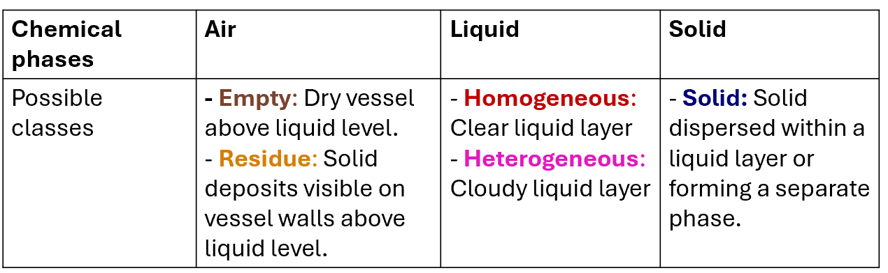

# HeinSight4.0 – A Computer Vision System for Dynamic Monitoring of Chemical Experiments
HeinSight4.0 is a computer vision system designed for real-time monitoring of chemical behavior. It detects and classifies chemical phases (air, liquid, solid) within vessels, enabling automated observation of common experimental behaviors such as dissolution, melting, suspension, mixing, settling, and more. It also extracts additional visual cues like turbidity and color through image analysis.

## How It Works?
HeinSight4.0 employs a hierarchical detection approach by training two separate models (Figure 1):
- Vessel Detection Model: Identifies transparent laboratory equipment (e.g., reactors and vessels) and marks them as "vessels."
- Chemical Detection Model: Detects chemical artifacts and phases within the identified vessels. The model classifies chemical phases into five categories, as outlined in Table 1.

The output of the vessel detection model serves as input for the chemical detection model, enabling phase-specific analysis. Both models were fine-tuned from YOLOv8 pretrained on the COCO dataset and adapted to our customized datasets.
Details on models training can be found here: 10.5281/zenodo.14630321




## Datasets
Vessel Dataset
Composed of 6493 images from the HeinSight3.0 dataset combined with additional images of reactors and vessels to expand detection capabilities across various laboratory setups.
	
Chemical Dataset
Includes 3801 images captured from video footage of dynamic chemical experiments.
Features diverse scenarios:
o	Varied background lighting
o	A range of colored liquids and compounds
o	Different solid forms and behaviors in liquid environments
This dataset enables monitoring of key experimental behaviors, including dissolution, melting, mixing, settling, and others, to address complex experimental conditions. A representative set of images is shown in Figure 2.


## Installation
The script was developed on Window, and tested on Windows and a Raspberry Pi 5. Python versions should be flexible and align with the requirements of Ultralytics
(Python>=3.8 environment with PyTorch>=1.8). 
```commandline
git clone https://gitlab.com/heingroup/heinsight2.5.git
cd heinsight2.5
pip install -r requirements.txt
```
### Enable CUDA
Note that PyTorch installation can be different when using a Nvidia GPU, check the [PyTorch](https://pytorch.org/) page for more detail.  
```
pip install torch torchvision torchaudio --index-url https://download.pytorch.org/whl/cu118
```

## Usage
```python
from heinsight.heinsight import HeinSight
heinsight = HeinSight(vial_model_path="models/labpic.pt",
                      contents_model_path=r"models/best_train5_yolov8_ez_20240402.pt")

# realtime analysis example
heinsight.run(0)
```


### Stream
Stream with a FastAPI app, in stream.py

```python
from heinsight.heinsight import HeinSight

...

heinsight = HeinSight(vial_model_path="models/labpic.pt",
                      contents_model_path=r"models/best_train5_yolov8_ez_20240402.pt")
source = 0

...
```
```commandline
pip install "fastapi[standard]"
fastapi run stream.py
```
### URLs
* Start monitoring:   localhost:8000/start 
* Stop monitoring:    localhost:8000/stop 
* Analysis output:    localhost:8000/frame

## Acknowledgements
Rama El-khawaldeh, Ivory Zhang, Ryan Corkery
